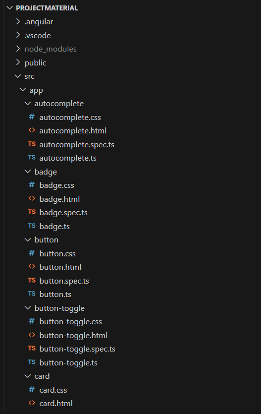
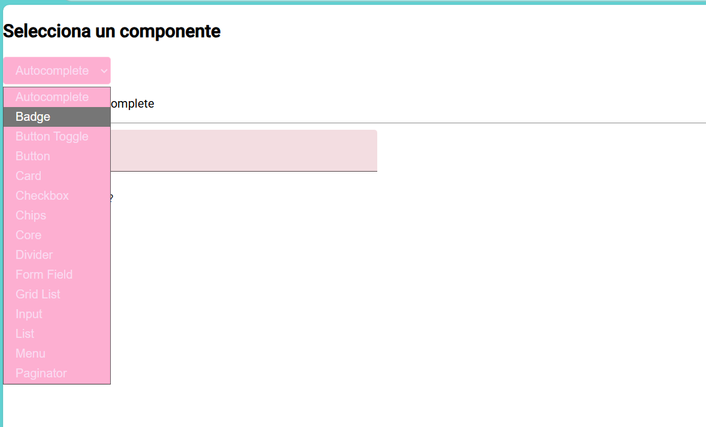
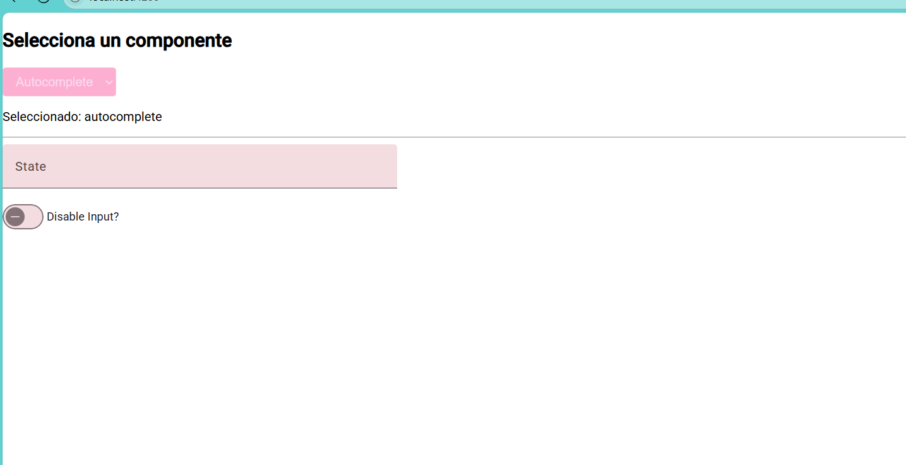

# Proyecto Angular con Componentes de Angular Material

Este proyecto fue desarrollado en Angular utilizando Visual Studio Code. Consiste en una interfaz gráfica que muestra componentes de Angular Material, como botones, tarjetas, formularios, menús, listas, paginadores y más.

El objetivo es tener un menú interactivo desde el cual se puede seleccionar cualquier componente y visualizar su comportamiento y estilos.

---

Autora
Martinez Lopez Fatima – Proyecto con Angular y Angular Material.

---
##  Tecnologías utilizadas

- [Angular 20 ](https://angular.io/)
- [Angular Material](https://material.angular.io/)
- TypeScript
- HTML / CSS
- Visual Studio Code

---

##  Estructura del Proyecto

El proyecto está organizado por carpetas, cada una conteniendo un componente individual, por ejemplo:




Cada subcarpeta contiene un componente `standalone` de Angular con su archivo `.ts`, `.html` y `.css`.

---

##  ¿Cómo funciona?

En la vista principal (`app.html`) se encuentra un menú desplegable (`<select>` o `<mat-select>`) que permite al usuario seleccionar uno de los componentes.

El componente seleccionado se muestra dinámicamente gracias a la vinculación con `[(ngModel)]` y la directiva `*ngIf`.

Por ejemplo:

```html
<select [(ngModel)]="componenteSeleccionado">
  <option value="button">Button</option>
  <option value="card">Card</option>
  ...
</select>

<app-button *ngIf="componenteSeleccionado === 'button'"></app-button>
<app-card *ngIf="componenteSeleccionado === 'card'"></app-card>
...
```
##  Características principales

Implementación de múltiples componentes UI de Angular Material.

Menú dinámico para navegar entre componentes.

Código limpio y modular.

Componentes independientes utilizando standalone: true.

---

## Capturas de Pantalla

A continuación se muestran ejemplos del funcionamiento:







## Demostración en Línea - GitHub Pages

Puedes probar el funcionamiento de la librería directamente aquí:

[Ver demostración en línea](https://fatimamartinezlpz.github.io/LibreriaJavaScript/)


